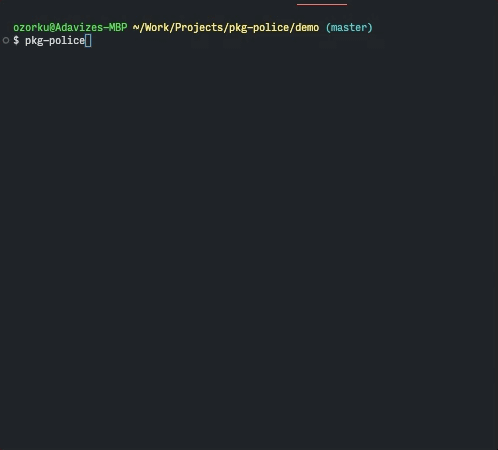

# 📦👮🏽 pkg-police

pkg-police is a CLI tool that lists out packages that are being used and those that aren't

#### Usage

Install glbally `npm install pkg-police -g`

Copy the [`pkg-police-script.js`](./pkg-police-script.js) and paste it in the root of your project.

Navigate to the root of the repo you want to check and run `pkg-police` to see results

#### Please note ⚠️

This tool is just a fun side project and far from perfect. Here is a much better alternative: [depcheck](https://www.npmjs.com/package/depcheck)

#### Demo

